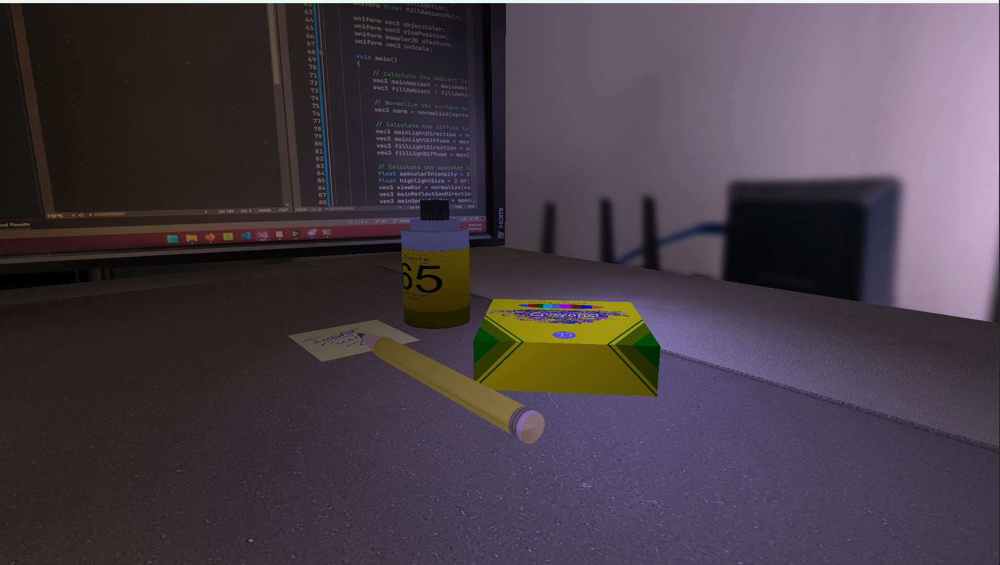
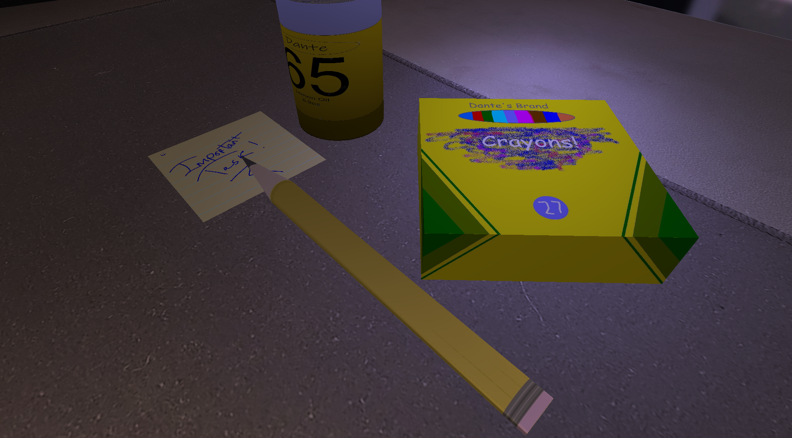
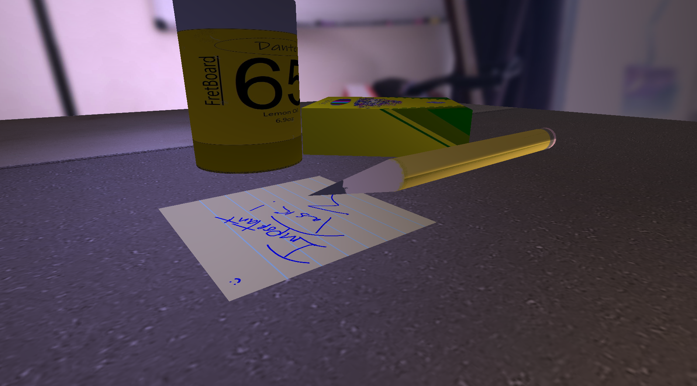

## CS-330 OpenGL Project
### Dante Trisciuzzi

---
### Info:
> This is my final project for the CS330 course, it is a 3d scene built on openGL (Using GLFW and GLEW) in C++. I worked hard on this application to keep things modular and easy to work with. There are some things that need improvement, like the texture creation system and the normal mapping system. Otherwise, I think it came out pretty well.

### Screenshots:

